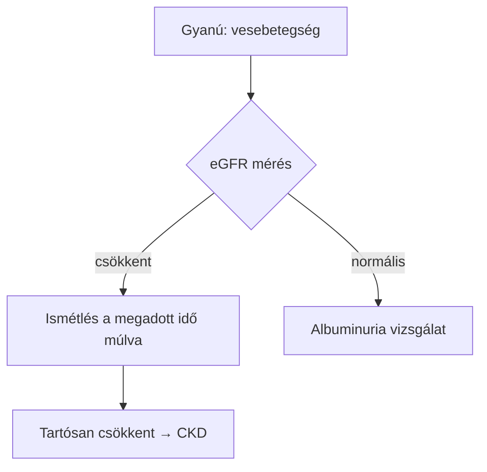

# 047. tétel – CKD: kezelés  *(MINTA – nem valódi tartalom)*

> Ez a fájl csak a formátumot mutatja be. **A `nyomtathato.py` automatikusan kihagyja**
> (a `000_` előtagú és `MINTA` nevű fájlokat kiszűri), tehát nem kerül a nyomtatási
> indexbe. Nyugodtan törölheted, amint az első valódi tételed elkészült.

## 1. LÉNYEG

A példamondat helye. Minden állítás után horgony áll [CKD-IRANYELV-BM-2025 | p.047].

## 2. KIFEJTÉS

### Diagnosztika

A diagnosztikai algoritmus ábraként is megadható, **de csak akkor, ha a lépések
és az elágazási feltételek szó szerint szerepelnek a forrásban**:

*Ábra forrása: [CKD-IRANYELV-BM-2025 | p.047] — minden elágazás a hivatkozott
szakaszból származik, nem következtetés.*

> **Figyeld meg: az ábrában NINCS szám.** Az „Ismétlés a megadott idő múlva"
> doboz nem írja ki, hogy 3 hónap — az a kísérő táblázatba való. Ennek oka,
> hogy az `ellenoriz_szamok.py` a Mermaid-dobozba írt számot **nem látja**,
> tehát az kicsúszna a gépi ellenőrzésből.

### Terápia

| Paraméter | Érték | Horgony |
|---|---|---|
| 🔢 eGFR G3a | 45–59 ml/min/1,73 m² | [CKD-IRANYELV-BM-2025 \| p.047] |

## 🔢 ELLENŐRZENDŐ SZÁMOK

| Érték | Kontextus | Horgony | Szó szerinti idézet |
|---|---|---|---|
| 45–59 | CKD G3a tartomány | [CKD-IRANYELV-BM-2025 \| p.047] | „…" |

## ❌ HIÁNYZÓ

Amit a tételsor kér, de a forrásokban nem találtam.

---

> ⚠️ Ez ellenőrizetlen piszkozat. A 🔢 jelölt értékeket vissza kell ellenőrizni.
